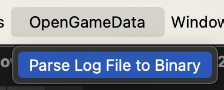
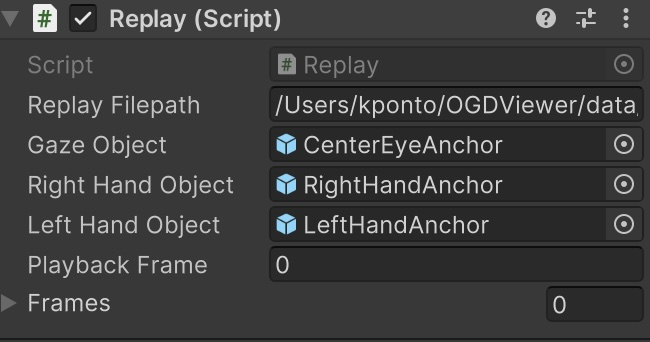

# opengamedata-replay
A Unity package for replay of games via log data

This is a light-weight package for creating replays from the OpenGameData log files.

## Ussage:

### Parsing the Log File
Add the `Parser.cs` to your project. 

Use the dropdown menu to choose a logfile

This script will parse these files and then convert individual sessions into binary files ready for playback.

### Replay
Add the `Replay.cs` to your project.

You will need to set the following:

* `Replay Filepath` the path to the binary replay file
* `Gaze Object` the gameobject associated with the players view
* `Right Hand Object` the gameobject associated with the right hand
* `Left Hand Object` the gameobject associated with the left hand
* `Quit on Completion` Once the replay has finished, should unity quit or exit playmode?
* `Enable Skipping` if we have large gaps in times between playback samples, should we skip ahead?
* `Time Diff to Trigger` How much of a gap of time do we need to skip ahead?

The other objects are currently made public for interactive analysis. 

With this all set, simply start the application and the playback should happen automatically.

### Replay to Video
Add the `ReplayToVideo.cs` to your project. To use this script ***you must install the [Unity Recorder Packager](https://docs.unity3d.com/Packages/com.unity.recorder@2.5/manual/index.html)***

In addition to the items above, the replay to video class has the following items

**Video Recording Parameters**
This panel has options related directly to the output video. These include:
* `Width` Output video width
* `Height` Output video height
* `FPS` Output video frames-per-second
* `Record Audio` Should the output video have sound?

### Create Videos from a folder of Binary Files
As the parser results in a series of binary files, it is possible to automate the video generation over all of these files. The easiest way to do this is to:

* Select the Object with the `Replay to Video` script attached. The parameters in this object are what will be used in this process. *** Makre sure `Quit on Completion` is turned on
* In the menu, select "Create Video from Folder of Replays"
* In the dialog, choose the folder you want to use 
* The process will now create a video for each of the replay files

#### Stopping the folder automation
To stop the folder animation, you can either:

* Unselect the object with the `Replay to Video` in the editor
* Set the `Replay Folder File Counter` to a negative number

## Log File Assumptions:
* Log files are constructed of tab-seperated values
* Columns exist for `session_id`, `event_name`, `event_data`, and `game_state` 
* Game State is formated as json with the following format:

> 		public class GameState
    {
        public float posX;
        public float posY;
        public float posZ;
        public float rotW;
        public float rotX;
        public float rotY;
        public float rotZ;
        public float seconds_from_launch;
    };
	 
* Events for gaze are under the name, `viewport_data` and event data is packed under the name `gaze_data_package`
* Events for right hand data is under the name, `right_hand_data` and event data is packed under the name `right_hand_data_package`
*  Events for left hand data is under the name, `left_hand_data` and event data is packed under the name `left_hand_data_package`
*  Packages are constructed as a list of Vector3 `pos` and Vector4 `rot`